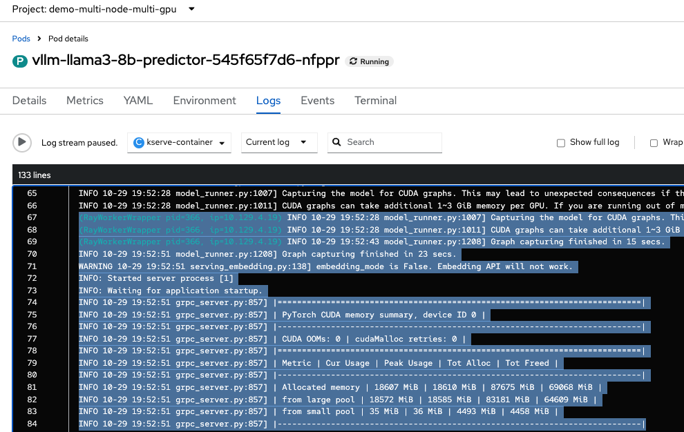
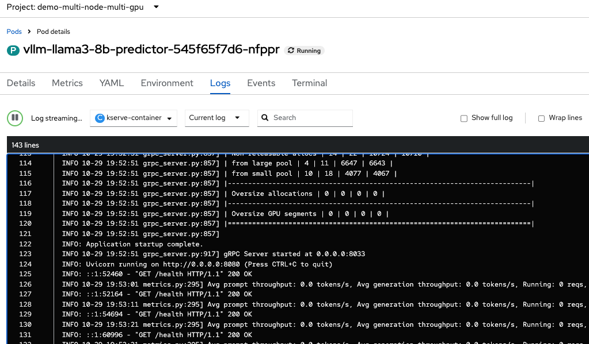
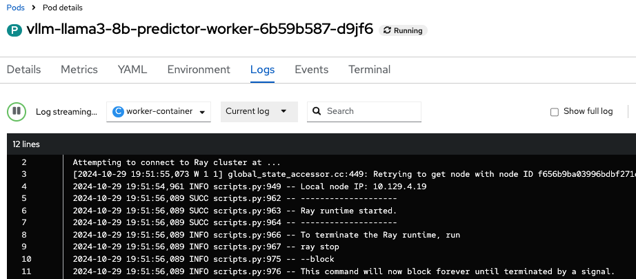
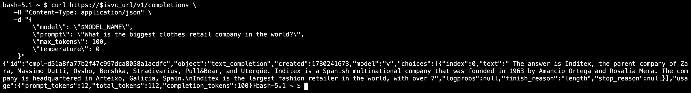
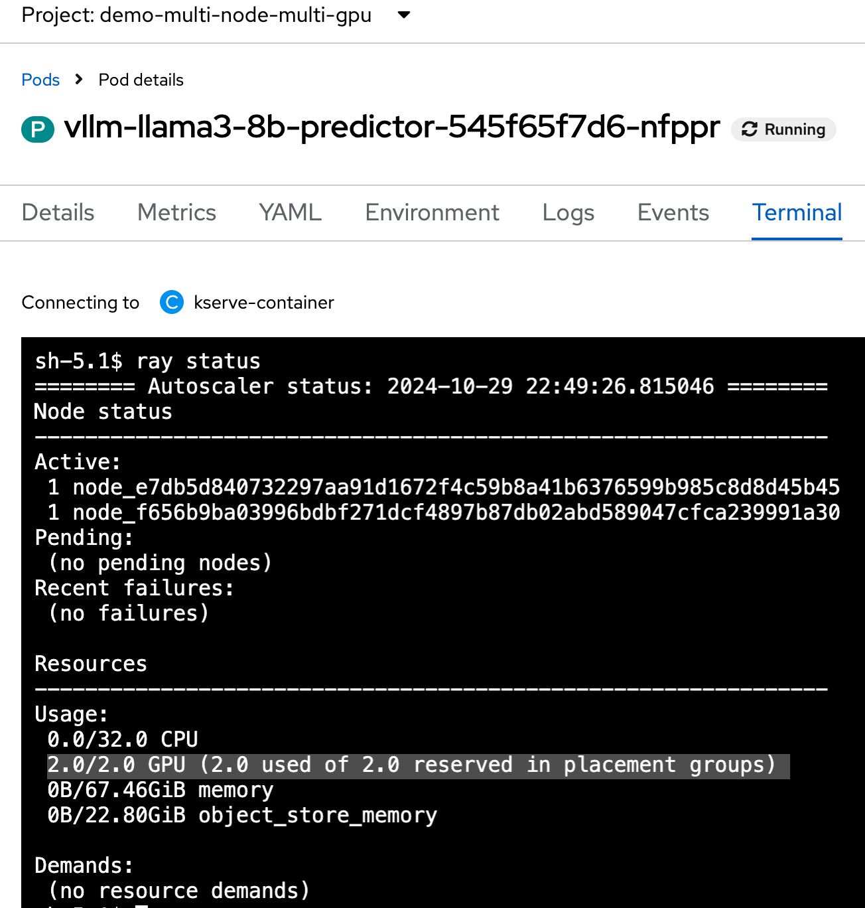

# Deploy LLMs with Multi-Node and Multi-GPUs

Deploying models with KServe simplifies model serving, but the rapid growth of Large Language Models (LLMs) makes deploying these massive models on a single GPU increasingly challenging. To address this, leveraging multiple GPUs across multiple nodes has become essential. Fortunately, vLLM supports multi-node/multi-GPU deployment using Ray, and with the serving runtime, `vllm-multinode-runtime`, OpenShift AI provides a solution for multi-node/multi-GPU setups.

This guide details the steps to enable multi-node/multi-GPU deployment with OpenShift AI model serving.

## Table of Contents
- [Deploy Big LLMs with Multi-Worker and Multi-GPUs](#deploy-big-llms-with-multi-worker-and-multi-gpus)
- [Important Disclaimer](#2-important-disclaimer)
- [Tested Scenarios](#3-tested-scenarios)
- [Considerations](#4-considerations)
- [Demo Guide](#5-demo-guide)
  - [Deploy RHOAI and Prereqs](#51-deploy-rhoai-and-prereqs)
  - [Deploy vLLM Multi-Node Prerequisites](#52-deploy-vllm-multi-node-prerequisites)
  - [Check and Validate the Model Deployed in Multi-Node with Multi-GPUs](#53-check-and-validate-the-model-deployed-in-multi-node-with-multi-gpus)
- [Notes for Multi-Node Setup](#6-notes-for-multi-node-setup)
  - [Parallelism Settings](#61-parallelism-settings)
  - [Supported GPU Types](#62-supported-gpu-types)
  - [Autoscaler Configuration](#63-autoscaler-configuration)
  - [Storage Protocol](#64-storage-protocol)

## 2. Important Disclaimer

> IMPORTANT DISCLAIMER: Read before proceed!

* This is **prototyping/testing work** intended to confirm functionality and determine the necessary requirements.
* These features are **not available in the RHOAI dashboard**. If you want to implement them, you will need to adapt YAML files to fit your use case.
* This content is authored by Red Hat experts, but has not yet been tested on every supported configuration.

## 3. Tested Scenarios

* OpenShift Cluster 4.15 (AWS)
* AWS g5.4xlarge instances (NVIDIA A10G - 24GiB vRAM)
* RHOAI 2.14

* [Llama3-8B - AWS g5.4xlarge (x2)](#53-check-and-validate-the-model-deployed-in-multi-node-with-multi-gpus)
* [Mixtral-8x7B - AWS g5.4xlarge (x8)](./docs/mixtral.md)

## 4. Considerations

1. **Deployment Mode**: Multi-node functionality is supported only in `RawDeployment` mode.
2. **Auto-scaling**: Not available for multi-node setups. The autoscaler will automatically be set to `external`.
3. **Persistent Volume Claim (PVC)**: Required for multi-node configurations, and it must support the `ReadWriteMany (RWX)` access mode.
4. **Required Operators**:
   - **Node Feature Discovery Operator**: Required to detect node features.
   - **NVIDIA GPU Operator**: Required to use GPUs for inference.

## 5. Demo Guide 

### 5.1 Deploy RHOAI and Prereqs

* Export Variables

```md
DEMO_NAMESPACE="demo-multi-node-multi-gpu"
MODEL_NAME="vllm-llama3-8b"
MODEL_TYPE="llama3"
```

* Install NFS Operator

```md
bash utils/nfs-operator.sh
```

* If you're in AWS, use the gpu-machineset script to provision a GPU machineset:

```md
bash utils/gpu-machineset.sh
```

* Install RHOAI and other operators

```md
kubectl apply -k 1-rhoai-operators/overlays/
```

* Install RHOAI, NFD, NFS and NVIDIA GPU Instances 

```md
kubectl apply -k 2-rhoai-instances/overlays/
```

### 5.2 Deploy vLLM Multi-Node prerequisites

* Deploy the prerequisites for the PoC including the Model

```md
kubectl apply -k 3-demo-prep/overlays/$MODEL_TYPE
```

* Deploy Custom CRD and vLLM Multi Node Serving Runtime Template

```md
kubectl apply -k 4-demo-deploy-is-sr/overlays
oc process vllm-multinode-runtime-template -n $DEMO_NAMESPACE | kubectl apply -n $DEMO_NAMESPACE -f -  
```

### 5.3 Check and Validate the Model deployed in Multi-Node with Multi-GPUs

* Check the GPU resource status:

```md
podName=$(oc get pod -n $DEMO_NAMESPACE -l app=isvc.$MODEL_NAME-predictor --no-headers|cut -d' ' -f1)
workerPodName=$(kubectl get pod -n $DEMO_NAMESPACE -l app=isvc.$MODEL_NAME-predictor-worker --no-headers|cut -d' ' -f1)

oc -n $DEMO_NAMESPACE wait --for=condition=ready pod/${podName} --timeout=300s
```

* You can check the logs for both the head and worker pods:

 - **Head Node**





 - **Worker Node**



*  Check the GPU memory size for both the head and worker pods:

```md
echo "### HEAD NODE GPU Memory Size"
kubectl -n $DEMO_NAMESPACE exec $podName -- nvidia-smi
echo "### Worker NODE GPU Memory Size"
kubectl -n $DEMO_NAMESPACE exec $workerPodName -- nvidia-smi
```

* Verify the status of your InferenceService, run the following command:

```md
oc wait --for=condition=ready pod/${podName} -n $DEMO_NAMESPACE --timeout=300s
export isvc_url=$(oc get route -n $DEMO_NAMESPACE |grep $MODEL_NAME| awk '{print $2}')
```

* Send a RESTful request to the LLM deployed in Multi-Node Multi-GPU:

```md
curl https://$isvc_url/v1/completions \
   -H "Content-Type: application/json" \
   -d "{
        \"model\": \"$MODEL_NAME\",
        \"prompt\": \"What is the biggest mountain in the world?\",
        \"max_tokens\": 100,
        \"temperature\": 0
    }"
```

* The answer of the LLM will look like this:



* You can also check the Ray cluster status with `ray status`:



## 6. Notes for Multi-Node Setup

1. **Parallelism Settings**:
   - `TENSOR_PARALLEL_SIZE` and `PIPELINE_PARALLEL_SIZE` cannot be set via environment variables. These must be configured through `workerSpec.tensorParallelSize` and `workerSpec.pipelineParallelSize`.
   - In a multi-node ServingRuntime, both `workerSpec.tensorParallelSize` and `workerSpec.pipelineParallelSize` must be specified.
   - The minimum values:
     - `workerSpec.tensorParallelSize`: 1
     - `workerSpec.pipelineParallelSize`: 2

2. **Supported GPU Types**:
   - Allowed GPU types: `nvidia.com/gpu` (default), `intel.com/gpu`, `amd.com/gpu`, and `habana.ai/gaudi`.
   - The GPU type can be specified in `InferenceService`. However, if the GPU type differs from what is set in the `ServingRuntime`, both GPU types will be assigned, potentially causing issues.
   - It's tested with different types of GPU within the **same family** like NVIDIA A10G and L40s.
3. **Autoscaler Configuration**: The autoscaler must be configured as `external`.

4. **Storage Protocol**:
   - The only supported storage protocol for `storageUri` is `PVC`.
