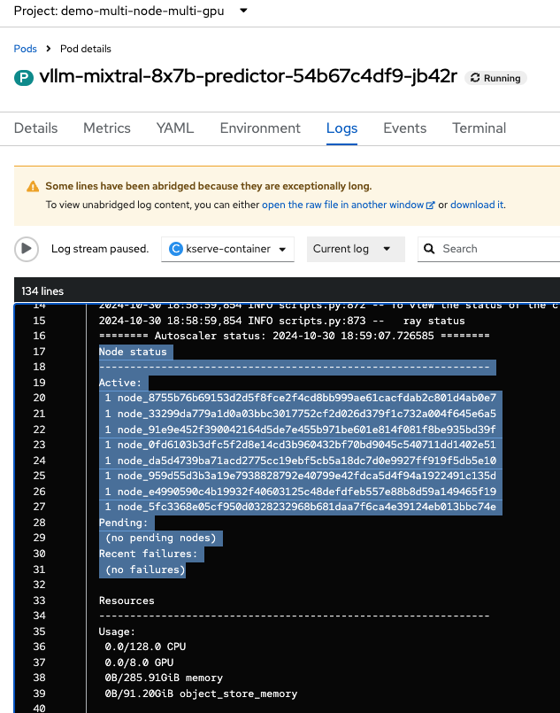
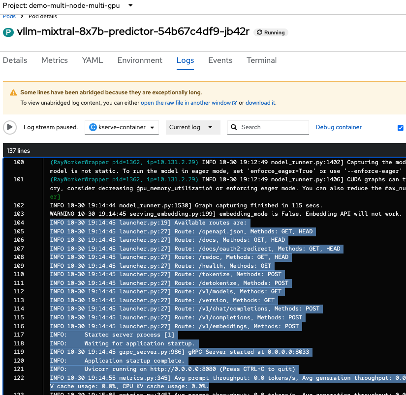
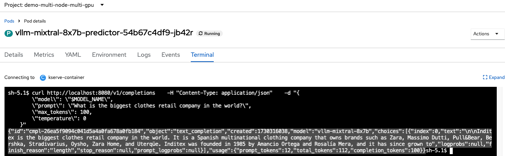

## Deploying Mixtral with Multi-Node Multi-GPU

This is tested with 8x g5.x4large AWS instances with 24GiB each.

## Demo Guide 

### Deploy RHOAI and Prereqs

If it's not deployed yet, follow the section of 5.1 Deploy RHOAI and Prereqs in the [README](../README.md).

### Deploy vLLM Multi-Node prerequisites

```md
DEMO_NAMESPACE="demo-multi-node-multi-gpu"
MODEL_NAME="mixtral-8-7b"
MODEL_TYPE="mixtral"
```

```md
kubectl apply -k 3-demo-prep/overlays/$MODEL_TYPE
```

* Deploy Custom CRD and vLLM Multi Node Serving Runtime Template

```md
kubectl apply -k 4-demo-deploy-is-sr/overlays
oc process vllm-multinode-runtime-template -n $DEMO_NAMESPACE | kubectl apply -n $DEMO_NAMESPACE -f -  
```

### Check and Validate the Model deployed in Multi-Node with Multi-GPUs

* Check the GPU resource status

```md
podName=$(oc get pod -n $DEMO_NAMESPACE -l app=isvc.$MODEL_NAME-predictor --no-headers|cut -d' ' -f1)
workerPodName=$(kubectl get pod -n $DEMO_NAMESPACE -l app=isvc.$MODEL_NAME-predictor-worker --no-headers|cut -d' ' -f1)

oc -n $DEMO_NAMESPACE wait --for=condition=ready pod/${podName} --timeout=300s
```





* Send a RESTful request to the LLM deployed in Multi-Node Multi-GPU:

```md
curl https://$isvc_url/v1/completions \
   -H "Content-Type: application/json" \
   -d "{
        \"model\": \"$MODEL_NAME\",
        \"prompt\": \"What is the biggest clothes retail company in the world?\",
        \"max_tokens\": 100,
        \"temperature\": 0
    }"
```


